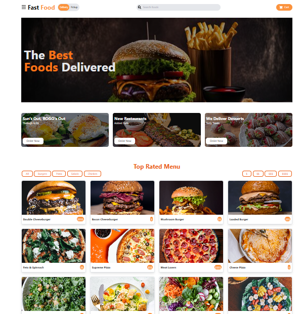

# Fast Food App build with the help of  React JS and styled With Tailwind CSS

# Fast Food Landing Page - React JS and TailWind CSS
This is a fast food landing page built using React and Tailwind, aimed at showcasing the  services and attracting potential customers. It features a modern and responsive design, providing an excellent user experience across various devices.

# Installation
Clone the repository to your local machine:
git clone https://github.com/your-username/fast-food-app.git
cd fast-food-app
Install the project dependencies:
Using npm:

npm install
Or using yarn:

yarn install
# Usage
To start the development server, run the following command:

Using npm:

npm start
Or using yarn:

yarn start
The application will now be accessible at http://localhost:3000/ in your web browser.

#Technologies Used
React – JavaScript library for building user interfaces.
HTML5 – Markup language for structuring web pages.
TailwindCSS – CSS framework for designing web pages.

# All of the data/images to simulate API responses are located at src/data/data.js

